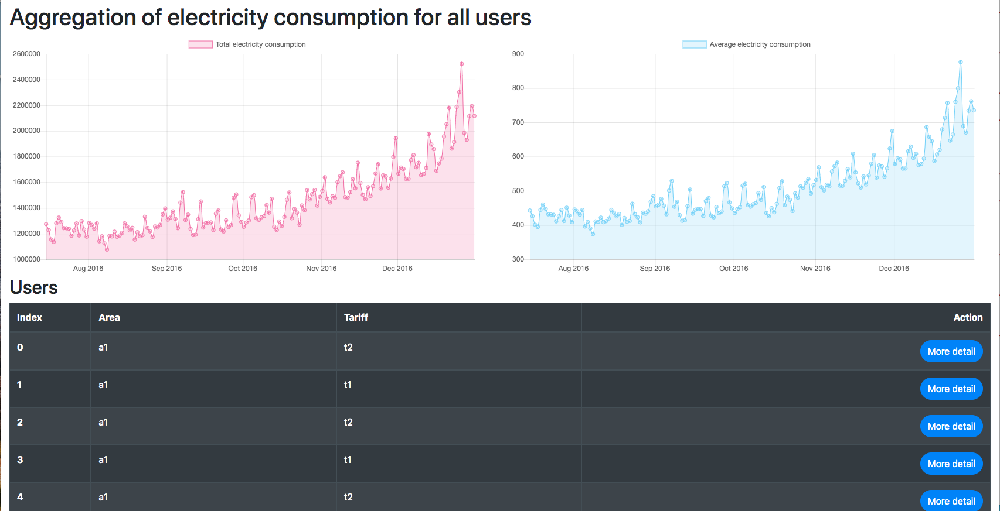

# Report

## How to install
```
pip install -r requirements.txt
```

## How to run
If you have a make commad, you can run easier and faster with Makefile. Look at Makefile at `./dashboard/Makefile`.

### 1. Migrate
```
cd ./dashboard/
python manage.py makemigrations
python manage.py migrate
```

### 2. Import datasets
```
python manage.py importer
```

### 3. Run a server

```
python manage.py runserver localhost:10000
```
Then you will see the following view on `http://localhost:10000/`.



### 4. Test it
```
python manage.py test
```


## Some of features

### Multiprocessing
The `./dashboard/consumption/management/commands/importer.py` uses multi-processing for making the process little bit faster. Because if current users are scaled to 9 billion users, a number of consumption datasets will increase significantly.

```
for i in tqdm(range(0, len(users), self.concurrent_exec_users_len)):
	with Pool(os.cpu_count()) as pool:
		data_frame = pd.concat(pool.map(read_csv_concurrently, users[i : i + self.concurrent_exec_users_len]))
	...
```
The source code above shows that it reads multiple csv datasets(consumptions of multiple users) concurrently. It means if you have enough CPU cores and RAM, the importing speed will be faster by increasing `self.concurrent_exec_users_len`.

However a machine I have has low level CPU(Intel i5, only 2 cores). Therefore I couldn't see obvious improvements. An accurate measurement is needed in the future.


### Tests
I tested importer and models with random datasets for some of the reasons like bellow.

- Whether the datasets are stored with Django's model correctly?
	- When you changed variable types or any other things, you can make sure if the data is correctly stored.
- Whether a result of aggregation is correct?
	- When you changed the way to aggregate, you can make sure if it is correct by comparing Django's results with SQLite's results.
- Whether a random datasets are correct?
	- Sometimes, random functions I created for test might make incomprehensible errors or bugs on the program.
	- At this challenge I encountered some bugs caused by a random function (after I modified a little feature). I think it is helpful.

I didn't test a frontend side because I didn't have enough time & there is no input from users while databasets(csv files) have more variety. Therefore I just tested datasets and data storing only.


## Q&A
### Why decimal instead of float?
There are two reasons. First, if a number of calculation is increased, the calculation makes a wrong result like bellow.

```
>>> sum([Decimal('0.1') for _ in range(1000000)])
Decimal('100000.0')
>>> sum([0.1 for _ in range(1000000)])
100000.00000133288
>>> 0.3 - 0.2
0.09999999999999998
```

Second, in decimal I am able to arrange a number of digits like bellow.

```
day_total = models.DecimalField(
	max_digits= 5 + math.ceil(math.log10(settings.CONSUMPTION_RECORD_PER_DAY)),
	decimal_places = 1) # NOTE: e.g. 999999.9
day_average = models.DecimalField(max_digits=14, decimal_places=10) # NOTE: e.g. 9999.9999999999
```


### Random functions I created for testing are safe?
In short, I am not sure yet.

Because I couldn't figure out, which distribution Python's random functions are using? (maybe, normal distribution) and which significance level I should define for this test? (probably 0.01 or 0.05 in general)

I used `scipy.stats.chisquare` to know about a variation in a result of a random function. If the variation is too much, the random functions might have a bug which I didn't expect. 

At this time I setup a significance level to 0.01 and distribution to normal distribution when I use stats.chisquare by following some of articles. Because I haven't tried a test againt a "random function" before.

```
# e.g. observed_frequencies =[99912, 100112, 100004, 100338, 100245, 99813, 100141, 99439, 100176, 99820]
# e.g. expected_frequencies =[100000, 100000, 100000, 100000, 100000, 100000, 100000, 100000, 100000, 100000]
_, p_value = stats.chisquare(f_obs=observed_frequencies, f_exp=expected_frequencies, ddof=distribution)
self.assertLess(self.SIGNIFICANCE_LEVEL, p_value) #0.01 < p_value
```

#### Reference
- [Degree of freedom of other distributions(ddof: -1 ~ -3)](https://www.globalspec.com/reference/69594/203279/10-8-the-chi-square-distribution)
- [Visualization of "Degree of freedom" for Chi-Square](https://blog.amedama.jp/entry/2016/11/20/173932)


## Issue you might have
When you increase following properties on `./dashboard/consumption/tests/test_aggregations.py`.

```
NUM_OF_USERS = 10
NUM_OF_CONSUMPTIONS = 10000
```

You might have to decrease `RELATIVE_TOLERANCE = 1e-8`. If you didn't, it causes an error at codes like bellow.

```
self.assertTrue(math.isclose(Decimal(row[1]), testing_row['day_total'], rel_tol=self.RELATIVE_TOLERANCE) )
```
    
Because SQLite's Real has no Decimal while Django has Decimal field. SQLite's Real is like 8 bite double variable. When "num of calculation is increased", a calculation error on SQLite will increase. Therfore you need to decrease the rate, `RELATIVE_TOLERANCE = 1e-8`.


## Future prospects
### GPU optimization
I sometimes use HLSL / GLSL as a GPU calculation language which make around 100 times faster than CPU calculation although it has some limitation.

However I haven't used a GPU based calcuration library with Python yet. And also, the calcuration library might not work on Windows/Linux (I prefer and have NVIDIA), means that reviewers of this challenge may not be able to execute. So I will try it by my own.

And plus, I found a GPU accelerated SQL and dataframe library which can run in Python. ([BlazingSQL (GPU accelerated SQL)](https://blazingsql.com/) and [cuDF (GPU DataFrames)](https://github.com/rapidsai/cudf).) These tools will make much more faster storing and calcuration at this project as well.


### Compare a muiti-processing program with a single-processing program. Then, optimize it with the result

As I mentions, a machine I have has low level CPU(Intel i5, only 2 cores) and user datasets are only 60 (menas O(10^1)). Therefore I couldn't see obvious improvements that much.

Look at some codes on `./dashboard/consumption/management/commands/importer.py` 

```
e_consumptions = [ElectricityConsumption(...) for row in data_frame.to_dict('records')] # Took about 13 seconds
ElectricityConsumption.objects.bulk_create(e_consumptions) # Took about 13 seconds
```

Each statement took about 13 seconds to execute when I measured. I am thinking that bulk_create() has alreadly used multi-processing because it has batch_size property. So I can't optimize any thing at this statement.

However the part `e_consumptions = [ElectricityConsumption(...) ...]` is able to use multi-processing by dividing dataframe. I have alreadly tried it once. unfortunately I couldn't see obvious improvements by this doing that because of my PC spec (probably).  So I should compare before and after in the future.

### Others

These are a list I didn't have enough time to do due to testing. I understand these things are important for reviewers and people who look at the codes in the future. However a priority of these at this challenge is low, I believe. So I skiped these.

- Write comments on each function (especially on `./dashboard/consumption/tests/extended_test_case.py`)
- Write logging and better stdout & stderr prints


